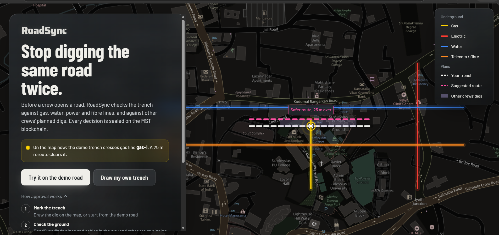

# RoadSync

**Stop digging the same road twice.**

RoadSync checks a planned trench against underground pipes and cables and other crews' planned digs,
suggests a safer route or a shared dig window, and seals every decision on the **MST blockchain**.
A smart contract refuses approval while any conflict is unresolved.

**Live demo:** https://roadsync-daogmcych-sanmathshetty13-4324s-projects.vercel.app/  
**Smart contract (MST Testnet, chain 91562037):** `0x58a25Ae76b410847ebAF65cA870Ce32512EcD788`

> Built for the MST Blockchain x NEWRRO 24-Hour Buildathon. All data is synthetic (a road in Mangaluru).



## The problem
Water boards, telecom companies and power and gas utilities dig up the same roads again and again.
Each keeps its own records, so crews hit pipes they didn't know about, roads are cut repeatedly,
and after an accident nobody can prove who was warned or when.

## How it works
1. **Mark:** a crew draws the planned trench on the map.
2. **Check:** RoadSync finds pipes and cables in the way and other crews digging nearby.
3. **Suggest:** a safer reroute (e.g. 25 m over) or a shared dig window.
4. **Seal:** the permit and any conflict are written to MST as hashes.
5. **Approve:** only the city agency can approve, and the contract refuses while a conflict is open.
6. **Verify:** re-hash the record and compare it with MST. Any secret edit is caught.

## How MST is used
| Action | Contract function | On-chain event |
|---|---|---|
| Submit permit | `submitWorkOrder` | `WorkOrderSubmitted` |
| Conflict found | `recordConflict` | `ConflictRecorded` |
| Reroute / shared window accepted | `resolveConflict` | `ConflictResolved` |
| Agency approves | `approveWorkOrder` | `WorkOrderApproved` |

- **Rules in code:** `approveWorkOrder` requires the agency's address and no open conflict.
- **Private and cheap:** utility maps stay off-chain; only 32-byte hashes go on MST.
- **Tamper-evident:** `/verify` compares the database record with the hash stored on-chain.

## Tech stack
- **Frontend:** React, Vite, Leaflet, OpenStreetMap (hosted on Vercel)
- **Backend:** Python, Flask, Shapely, pyproj, SQLite (hosted on Render)
- **Blockchain:** Solidity 0.8.19 on MST Testnet, web3.py, Bridgekey wallet

## Run locally
**Backend**
```
cd backend
python -m venv venv
venv\Scripts\activate            (Mac/Linux: source venv/bin/activate)
pip install -r requirements.txt
copy .env.example .env           then fill in DEPLOYER_PRIVATE_KEY and CONTRACT_ADDRESS
python seed.py
python app.py                    -> http://localhost:5000
```
**Frontend**
```
cd frontend
npm install
npm run dev                      -> http://localhost:5173
```

## Tests
- `python backend/test_engine.py`: geometry engine
- `python backend/test_chain_flow.py`: full API and contract flow on a local test chain (`pip install "web3[tester]"` once)

## Project layout
```
contracts/RoadSync.sol     smart contract
backend/engine.py          conflicts, reroute, coordination (Shapely + UTM)
backend/chain.py           web3.py calls to MST
backend/app.py             Flask API (see API.md)
frontend/src/              React app: landing page, permit desk, map, on-chain history
```

## Roadmap
- Wallet sign-in per organisation, so each permit is signed by the organisation that filed it
- Agency-managed registry of approved organisation wallets in the contract
- Integration with real city utility and GIS records
- Robotic excavators that check on-chain approval before breaking ground

## Team
- **Sanmath Shetty**: Backend and blockchain lead. Flask API, conflict engine, smart contract deployment on MST, and web3 integration.
- **Saanvi Rai**: Frontend developer. React UI, interactive map and the permit flow.
- **Shashank S**: Smart contract and testing. Contract design, on-chain flow testing and deployment support.
- **Deeksha S**: Product and presentation. Demo video, prototype design, pitch deck and documentation.
